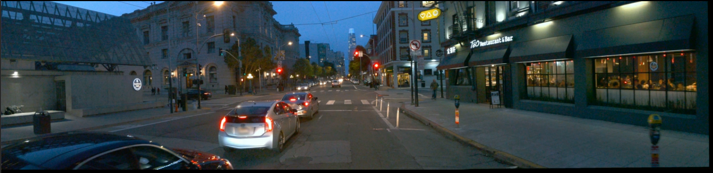

# Video Panorama Stitcher

GPU-accelerated video panorama stitcher for multi-camera setups. Combines footage from 3 cameras (left, center, right) into seamless wide-angle panoramic videos.
# Multi-Camera Video Stitching (2 & 3 Camera)

Python-based video stitching system supporting
static and moving cameras using homography,
OpenCV, and optional GPU acceleration.


Dataset- waymo dataset and custom datasets

## Features

- **3-Camera Stitching**: Combines left, center, and right camera feeds into a single panorama
- **GPU Acceleration**: CUDA-accelerated warping, color conversion, and blending (with CPU fallback)
- **Moving Camera Support**: Adaptive homography recalculation for dynamic scenes
- **Hardware Video Decoding**: NVDEC support for faster video loading
- **Hardware Video Encoding**: NVENC support for faster MP4 output
- **Color Correction**: LAB color space matching to minimize seam visibility
- **Smooth Blending**: Gradient-based blending with parallax-aware adjustments
- **Real-time Preview**: Live visualization of stitching progress
- **Threaded I/O**: Parallel video reading for improved performance

- ## 📸 Output Examples

### 2-Camera Stitching


### 3-Camera Stitching


## 🎥 Demo Video
👉 [Download 3-Camera Demo](assets/demo_3cam.mp4)


## Requirements

### System Dependencies

- Python 3.8+
- OpenCV 4.x (with CUDA support recommended)
- FFmpeg (with NVENC support recommended)
- NVIDIA GPU (optional but recommended)

### Python Dependencies

```bash
pip install numpy opencv-python psutil pynvml
```

For GPU acceleration, you'll need OpenCV built with CUDA support:

```bash
# Check if CUDA is available in your OpenCV build
python -c "import cv2; print(cv2.cuda.getCudaEnabledDeviceCount())"
```

## Installation

1. Clone the repository:
```bash
git clone https://github.com/yourusername/video-panorama-stitcher.git
cd video-panorama-stitcher
```

2. Install dependencies:
```bash
pip install -r requirements.txt
```

3. (Optional) For GPU acceleration, install OpenCV with CUDA support.

## Usage

### Basic Usage

Edit the video paths at the bottom of `3camera.py`:

```python
LEFT_VIDEO = "camera1.mp4"      # Left camera
CENTER_VIDEO = "camera0.mp4"    # Center camera  
RIGHT_VIDEO = "camera3.mp4"     # Right camera

stitch_videos_3cam(
    left_video_path=LEFT_VIDEO,
    center_video_path=CENTER_VIDEO,
    right_video_path=RIGHT_VIDEO,
    output_name=None,           # Auto-generates timestamped name
    show_preview=True,
    moving_camera=True          # Enable for moving camera footage
)
```

Run the script:

```bash
python 3camera.py
```

### Command Line (Programmatic)

```python
from 3camera import stitch_videos_3cam

output = stitch_videos_3cam(
    left_video_path="left.mp4",
    center_video_path="center.mp4",
    right_video_path="right.mp4",
    output_name="panorama.mp4",
    show_preview=False,
    moving_camera=True
)
```

### Parameters

| Parameter | Type | Default | Description |
|-----------|------|---------|-------------|
| `left_video_path` | str | required | Path to left camera video |
| `center_video_path` | str | required | Path to center camera video |
| `right_video_path` | str | required | Path to right camera video |
| `output_name` | str | None | Output filename (auto-generated if None) |
| `show_preview` | bool | True | Show live preview window |
| `moving_camera` | bool | False | Enable moving camera mode |

## Waymo Dataset Example

This stitcher works well with the Waymo Open Dataset camera feeds:

- `camera_0` → Front (center)
- `camera_1` → Front-Left  
- `camera_3` → Front-Right

```python
LEFT_VIDEO = "camera_1.mp4"     # Front-Left
CENTER_VIDEO = "camera_0.mp4"   # Front
RIGHT_VIDEO = "camera_3.mp4"    # Front-Right
```

## How It Works

### Stitching Pipeline

1. **Sequential Stitching**: LEFT + CENTER → intermediate → intermediate + RIGHT → final
2. **Feature Detection**: SIFT features with BFMatcher
3. **Homography Estimation**: RANSAC-based with affine constraint fallback
4. **Perspective Warping**: GPU-accelerated when available
5. **Color Matching**: LAB color space transfer between overlapping regions
6. **Gradient Blending**: Smooth transitions with luminance protection

### Moving Camera Mode

When `moving_camera=True`:
- Recalculates homography every 30 frames (keyframe interval)
- Uses temporal smoothing on homography matrices
- Falls back to cached homography on match failures
- Handles dynamic scenes with changing perspectives

## Performance

Typical performance on RTX 3080:
- 1920×1280 input → ~4000×1280 output
- 15-25 FPS processing speed
- GPU utilization: 60-80%

## Output

The stitcher outputs:
- Phase 1: Raw stitched frames (MJPEG AVI)
- Phase 2: Re-encoded MP4 (H.264 via NVENC or libx264)

Progress display shows:
- Frame count and percentage
- Current and average FPS
- CPU/RAM/GPU utilization
- ETA

## Troubleshooting

### "Not enough matches"
- Ensure cameras have overlapping fields of view
- Try adjusting `FEATURE_COUNT` or `ratio` parameter
- Check that videos are synchronized

### Black borders in output
- Normal for non-overlapping regions
- Adjust `BLEND_WIDTH` if seams are visible

### Slow performance
- Enable GPU acceleration with CUDA-enabled OpenCV
- Use NVDEC/NVENC for hardware video coding
- Reduce preview window updates

## License

MIT License - see LICENSE file for details.

## Acknowledgments

- OpenCV team for the excellent computer vision library
- Waymo for the Open Dataset used in development
